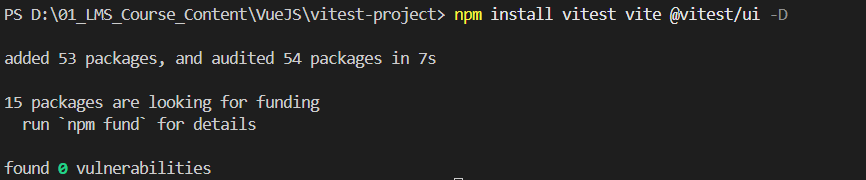
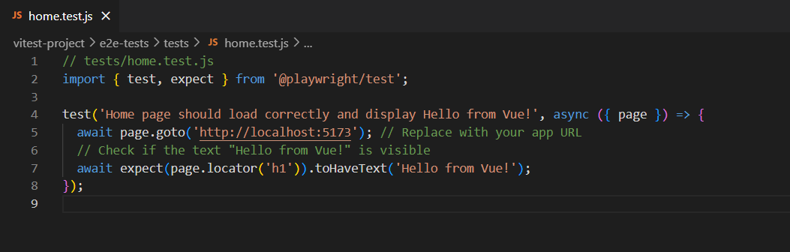
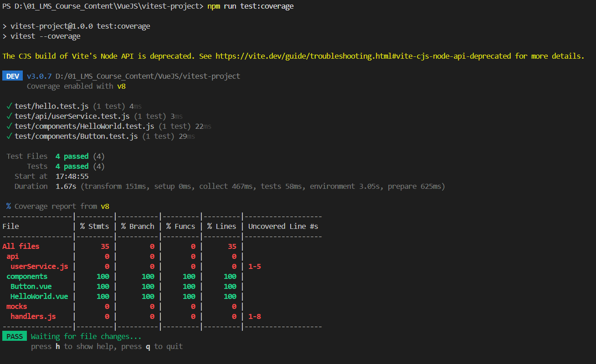

# Vitest

* [**Intro to Vitest**](#intro-to-vitest)
* [**Writing Unit Tests for Components**](#writing-unit-tests-for-components)
* [**Snapshot Testing**](#snapshot-testing)
* [**Mocking API Calls**](#mocking-api-calls)
* [**End-to-End Testing (E2E)**](#end-to-end-testing)
* [**Coverage & Jest Migration**](#coverage-&-jest-migration)

## **Intro to Vitest**

Vitest is a **blazing-fast unit testing framework** for JavaScript and TypeScript applications. It is designed to be **lightweight, efficient, and highly compatible** with modern frontend frameworks like React, Vue, and Svelte.

Vitest is built on top of **Vite**, leveraging its fast server capabilities and **ESBuild** for rapid execution, making it significantly **faster than Jest** and other traditional testing frameworks.

### **Features of Vitest**

- **Lightning Fast** – Uses **Vite and ESBuild** for near-instant test execution.
- **Built-in TypeScript Support** – No additional setup required for TypeScript projects.
- **First-Class ESM Support** – Works seamlessly with modern **ECMAScript Modules (ESM)**.
- **Node & Browser Support** – Allows testing in **Node.js and JSDOM** for frontend tests.
- **Watch Mode** – Automatically **reruns tests** when files change, boosting development speed.
- **Snapshot Testing** – Supports **snapshot testing** for UI-based applications.
- **Mocking & Spying** – Built-in APIs for **mocking modules, timers, and spies**.
- **Code Coverage** – Integrated coverage reports using `--coverage`.
- **Vitest UI** – A built-in interactive **test runner UI** to visualize test results in the browser.
- **Jest Compatibility** – Many Jest APIs (`describe`, `it`, `expect`) work out of the box.

---

### **Installing Vitest**

To start, initialize a new project:

```sh
mkdir vitest-project && cd vitest-project
npm init -y # or yarn init -y
```

The `npm init -y` or `yarn init -y` command creates a `package.json` file with default settings for the project.


Then, install Vitest along with Vite and Vitest UI:

```sh
npm install vitest vite @vitest/ui -D # or yarn add vitest vite @vitest/ui -D
```

- `vitest`: The core Vitest testing framework.
- `vite`: The Vite build tool, required for Vitest.
- `@vitest/ui`: Provides a graphical user interface for running and managing tests.



---

### **Configuring Vitest**

Create a `vite.config.js` file and add the following configuration:

```js
/// vite.config.js
import { defineConfig } from 'vite';

export default defineConfig({
  server: {
      host: '0.0.0.0'
  },
  test: {
    globals: true
  },
});
```

- `server.host: '0.0.0.0'`: Ensures the test server is accessible from any network.
- `test.globals: true`: Enables global test functions like `describe`, `it`, and `expect` without needing explicit imports.


---

### **Writing Your First Test**

Create a `tests/hello.test.js` file and add the following test:

```js
/// tests/hello.test.js
import { describe, it, expect } from 'vitest';

describe('My First Test Suite', () => {
  it('should pass', () => {
    expect(true).toBe(true);
  });
});
```

- `describe()`: Groups related tests together.
- `it()`: Defines an individual test case.
- `expect()`: Asserts expected outcomes.


---

### **Running Tests**

To execute your tests, add a test script to your `package.json`:

```json
"scripts": {
  "test": "vitest",
  "test:ui": "vitest --ui"
}
```

- `"test": "vitest"`: Runs all tests in the project.
- `"test:ui": "vitest --ui"`: Starts Vitest in UI mode.


Now, run the tests using:

```sh
npm run test # or yarn test
```

- This command runs all test files that match `*.test.js` or `*.spec.js`.
- The output will display **pass/fail status** for each test.

```sh
✓ My First Test Suite > should pass
```


For a visual UI in the browser:

```sh
npm run test:ui # or yarn test:ui
```

- This starts a **graphical interface** where you can see test results in real time.
- The UI will be available at `http://localhost:51204/__vitest__/`.
- You can **rerun individual tests** and **view snapshots** easily.


---

### **Understanding Test Output**

When running `npm run test`, you will see an output similar to:

```sh
✓ My First Test Suite > should pass (2ms)
Total: 1 Passed: 1 Failed: 0 Skipped: 0
```

- `✓` indicates a successful test.
- `Total`: Total number of tests executed.
- `Passed`: Number of tests that passed.
- `Failed`: Number of tests that failed.
- `Skipped`: Tests that were ignored or not run.

If a test fails, the error message will indicate what went wrong:

```sh
✖ My First Test Suite > should pass
Error: Expected false to be true
```

You can debug failing tests using:

```sh
vitest --run --reporter verbose
```

This will provide a **detailed output** with stack traces.

---

## **Writing Unit Tests for Components**

Unit testing is a software testing technique where individual components or functions of a program are tested in isolation to ensure they work as expected. The primary goal is to catch bugs early in the development process and improve code reliability.

### **Key Characteristics of Unit Testing**

* **Isolated Testing** – Each test focuses on a single unit (function, method, or component).
* **Automated Execution** – Unit tests are usually automated and run using testing frameworks like Vitest, Jest, Mocha, or JUnit.
* **Fast & Lightweight** – Since unit tests only test small parts of a program, they execute quickly.
* **Prevention of Regression** – Running unit tests helps ensure new changes don’t break existing functionality.

### **Setting Up Vitest in Vue Project**

Install Vue plugin `@vitejs/plugin-vue`

```sh
npm install @vitejs/plugin-vue -D
```


Modify your `vite.config.js` to include Vitest configuration:

```js
/// vite.config.js
import { defineConfig } from 'vite';
import vue from '@vitejs/plugin-vue';

export default defineConfig({
  plugins: [vue()],
  test: {
    globals: true,
    environment: 'jsdom',
  },
});
```


### **Writing Your First Component Test**

Let's create a simple `HelloWorld.vue` component inside the `src/components/` folder:

```vue
<!-- src/components/HelloWorld.vue -->
<template>
  <h1>{{ msg }}</h1>
</template>

<script setup>
defineProps({ msg: String });
</script>
```


### **Creating a Test File**

Inside `tests/components/`, create `HelloWorld.test.js`:

```js
/// tests/components/HelloWorld.test.js
import { mount } from '@vue/test-utils';
import { describe, it, expect } from 'vitest';
import HelloWorld from '../../src/components/HelloWorld.vue';

describe('HelloWorld Component', () => {
  it('renders the message properly', () => {
    const wrapper = mount(HelloWorld, {
      props: { msg: 'Hello Vitest!' },
    });
    expect(wrapper.text()).toContain('Hello Vitest!');
  });
});
```


### **Running the Test**

Add the test script to your `package.json`:

```json
"scripts": {
  "test": "vitest",
  "test:ui": "vitest --ui"
}
```

Now, run the tests using:

```sh
npm run test
```


For a visual UI:

```sh
npm run test:ui
```


## **Snapshot Testing**

Snapshot testing is a technique used to verify that the output of a component or function remains consistent over time. It is particularly useful for testing UI components to ensure they don’t change unexpectedly.

Vitest provides built-in support for snapshot testing, making it easy to capture and compare component outputs.

### **Creating a Snapshot Test**

Let's create a simple `Button.vue` component inside the `src/components/` folder:

```vue
<!-- src/components/Button.vue -->
<template>
  <button class="btn">{{ label }}</button>
</template>

<script setup>
defineProps({ label: String });
</script>
```


### **Writing a Snapshot Test**

Inside `tests/components/`, create `Button.test.js`:

```js
/// tests/components/Button.test.js
import { mount } from '@vue/test-utils';
import { describe, it, expect } from 'vitest';
import Button from '../../src/components/Button.vue';

describe('Button Component', () => {
  it('matches the snapshot', () => {
    const wrapper = mount(Button, {
      props: { label: 'Click Me' },
    });
    expect(wrapper.html()).toMatchSnapshot();
  });
});
```


### **Running Snapshot Tests**

Add the test script to your `package.json`:

```json
"scripts": {
  "test": "vitest",
  "test:ui": "vitest --ui"
}
```

Run the test using:

```sh
npm run test
```


### **How Snapshot Testing Works**

- The first time you run the test, Vitest generates a snapshot file inside `__snapshots__/`.


- On subsequent runs, Vitest compares the component output with the stored snapshot.
- If the output differs, Vitest reports a test failure, indicating an unexpected change.

To make the test fail, modify the `Button.vue` component slightly. For example, change the button's text wrapping or add a new class:

**Update `Button.vue`:**

```js
<!-- src/components/Button.vue -->
<template>
  <button class="btn primary">{{ label }}!</button>  <!-- Added '!' and new class -->
</template>

<script setup>
defineProps({ label: String });
</script>
```


Rerun the test to check the test fails:

```sh
npm run test
```


### **Updating Snapshots**

If the component output changes intentionally (e.g., UI update), update the snapshot using:

```sh
npm run test -- -u
```


This regenerates the snapshot files with the new output.

## **Mocking API Calls**

Mocking API calls is essential in unit testing to isolate the component or function from external dependencies. In Vitest, you can mock API calls using built-in features like `vi.fn()`, `vi.mock()`.

### **Mocking API Calls with `vi.fn()` &  `vi.mock()`**

* A simple way to mock an API function is by using `vi.fn()` to return a controlled response 
* Instead of mocking individual functions, you can mock entire modules using `vi.mock()`.

#### **Example**

Let us create a function makes an actual network request to fetch user data.

```js
// src/api/userService.js
export async function fetchUser() {
  const response = await fetch('https://jsonplaceholder.typicode.com/users/1');
  return response.json();
}
```


#### **Writing a Test with `vi.fn()`**

Let us write test case to mock an API Function

```js
/// test/api/userService.test.js
import { describe, it, expect, vi } from 'vitest';
import { fetchUser } from '../../src/api/userService';

// Mock the API function
vi.mock('../../src/api/userService', () => ({
  fetchUser: vi.fn(() => Promise.resolve({ id: 1, name: 'John Doe' })),
}));

describe('fetchUser API', () => {
  it('returns mock user data', async () => {
    const user = await fetchUser();
    expect(user).toEqual({ id: 1, name: 'John Doe' });
  });
});
```

* `vi.mock()` replaces the original `fetchUser` function with a mock version.
* `vi.fn(() => Promise.resolve({...}))` ensures the test does not make real API calls.
The test checks if `fetchUser()` returns `{ id: 1, name: 'John Doe' }`.


#### **Running Tests**

Run the test using:

```sh
npm run test
```


Mocking API calls with Vitest ensures that tests remain reliable and independent of real network responses. 

## **End-to-End Testing**

End-to-End (E2E) testing ensures that an application functions correctly from start to finish, simulating real user interactions. While Vitest is mainly used for unit testing, it can also be used for E2E testing when combined with tools like Playwright or Cypress.

### **Why E2E Testing?**

* Ensures the entire application works as expected.
* Detects issues that unit or integration tests might miss.
* Simulates real user interactions.

To create a **separate project for E2E testing**, follow these steps:  

---

### **1. Create a New Project Directory**  

Open your terminal and run:  

```sh
mkdir e2e-tests && cd e2e-tests
npm init -y
```


This creates a new directory `e2e-tests` and initializes a `package.json` file.

---

### **2. Install Playwright**  

Since E2E testing requires browser automation, install Playwright: 

```sh
npm install --save-dev @playwright/test
```


Then, install the necessary browsers:  

```sh
npx playwright install
```


---

### **3. Set Up Playwright Configuration**  

Create a `playwright.config.js` file in the project root:  

```js
// playwright.config.js
import { defineConfig } from '@playwright/test';

export default defineConfig({
  webServer: {
    command: 'npm run dev', // Change this to your app's startup command
    port: 5173,             // Ensure it matches your app's port
    timeout: 120 * 1000,    // Wait up to 2 minutes
    reuseExistingServer: true, 
  },
  use: {
    headless: false, // Set to true for running tests without opening a browser
    viewport: { width: 1280, height: 720 },
  },
});
```


---

### **4. Create E2E Test Files**  

Inside your project, create a directory for tests:  

```sh
mkdir tests && cd tests
```


Create a test file `home.test.js`:  

```js
// tests/home.test.js
import { test, expect } from '@playwright/test';

test('Home page should load correctly and display Hello from Vue!', async ({ page }) => {
  await page.goto('http://localhost:5173'); // Replace with your app URL
  // Check if the text "Hello from Vue!" is visible
  await expect(page.locator('h1')).toHaveText('Hello from Vue!');
});
```



---

### **5. Create a HelloWorld Project** 

#### **Create a New Vite Project**  

Run the following command in your terminal: 

```sh
npm create vite@latest hello-world -- --template vue
```

**Explanation:**

* `npm create vite@latest` → Creates a new project using the latest version of Vite.
* `hello-world` → The name of your project folder.
* `-- --template vue` → Specifies that you want the latest version of Vue 3 as the template.


This will create a **Vue 3 + Vite** project inside a folder called `hello-world`.

---

#### **Navigate into the Project and Install Dependencies** 

```sh
cd hello-world
npm install
```


---

#### **Run the Development Server** 

```sh
npm run dev
```

If successful, it will display a message like this:


Now, open [http://localhost:5173/](http://localhost:5173/) in your browser.

---

#### **Modify `HelloWorld.vue`**  

Open `src/components/HelloWorld.vue` and update it:

```vue
<template>
  <h1>{{ msg }}</h1>
</template>

<script setup>
defineProps({ msg: String });
</script>
```

---

#### **Import `HelloWorld.vue` in `App.vue`**  

Modify `src/App.vue`:

```vue
<template>
  <HelloWorld msg="Hello from Vue!" />
</template>

<script setup>
import HelloWorld from './components/HelloWorld.vue';
</script>
```

---

#### **Restart the Server** 

If you made changes and the page doesn't update, restart the server:  

```sh
npm run dev
```

---

### **6. Run E2E Tests**  

To execute the tests, run: 

```sh
npx playwright test
```


For a **visual test mode**:  

```sh
npx playwright test --headed
```


For **debug mode**: 

```sh
npx playwright test --debug
```


---

### **6. (Optional) Add Scripts to package.json**  

Modify `package.json` to include test scripts: 

Adding these scripts to your package.json makes running Playwright tests more convenient and standardized.

```json
"scripts": {
  "test:e2e": "npx playwright test",
  "test:e2e:headed": "npx playwright test --headed",
  "test:e2e:debug": "npx playwright test --debug"
}
```


Now, you can run tests using:  

```sh
npm run test:e2e
```


---

## **Coverage & Jest Migration**

### **1. Checking Test Coverage in Vitest**

Vitest provides built-in support for test coverage reporting using `v8`.

#### **Enable Coverage Reporting**

First, install `v8` for coverage analysis:

```sh
npm install -D @vitest/coverage-v8
```


Then, modify your `package.json` to include a coverage script:

```json
"scripts": {
  "test": "vitest",
  "test:coverage": "vitest --coverage"
}
```


To customize coverage output, add a `vitest.config.js` file:

```js
import { defineConfig } from 'vitest/config';

export default defineConfig({
  test: {
    coverage: {
      provider: 'v8', // or 'istanbul'
    },
  },
});
```

Run the coverage report:

```sh
npm run test:coverage
```

This will generate a report showing which lines of your code are covered by tests.



Open the `coverage/index.html` file in a browser to view the detailed coverage report.


---

### **2. Migrating from Jest to Vitest**

#### **Install Vitest**

If your project currently uses Jest, uninstall it:

```sh
npm remove jest @jest/globals
```

Then install Vitest:

```sh
npm install -D vitest
```

#### **Update Configuration**

Replace `jest.config.js` with `vitest.config.js`:

```js
import { defineConfig } from 'vitest/config';

export default defineConfig({
  test: {
    globals: true,
    environment: 'jsdom', // Use 'node' if testing non-DOM code
  },
});
```

#### **Modify Test Imports**

Jest uses `jest.fn()` and `jest.mock()`, while Vitest uses `vi.fn()` and `vi.mock()`. Update your test files accordingly:

#### **Jest (Before Migration)**

```js
import { jest } from '@jest/globals';
import { fetchData } from '../api';

test('fetchData returns mock data', async () => {
  jest.spyOn(global, 'fetch').mockResolvedValue({
    json: jest.fn().mockResolvedValue({ message: 'success' })
  });
  
  const data = await fetchData();
  expect(data).toEqual({ message: 'success' });
});
```

#### **Vitest (After Migration)**

```js
import { vi, test, expect } from 'vitest';
import { fetchData } from '../api';

test('fetchData returns mock data', async () => {
  vi.spyOn(global, 'fetch').mockResolvedValue({
    json: vi.fn().mockResolvedValue({ message: 'success' })
  });
  
  const data = await fetchData();
  expect(data).toEqual({ message: 'success' });
});
```

#### **Replace Jest Matchers**

Vitest supports most Jest matchers, but some might require updates:

| Jest Matcher          | Vitest Equivalent           |
| --------------------- | --------------------------- |
| `jest.fn()`           | `vi.fn()`                   |
| `jest.mock()`         | `vi.mock()`                 |
| `jest.spyOn()`        | `vi.spyOn()`                |
| `expect.toBeCalled()` | `expect.toHaveBeenCalled()` |

---

### **3. Running Tests with Vitest**

To run your tests, use:

```sh
npm run test
```

For coverage analysis:

```sh
npm run test:coverage
```

To run tests in watch mode:

```sh
npx vitest --watch
```

---

